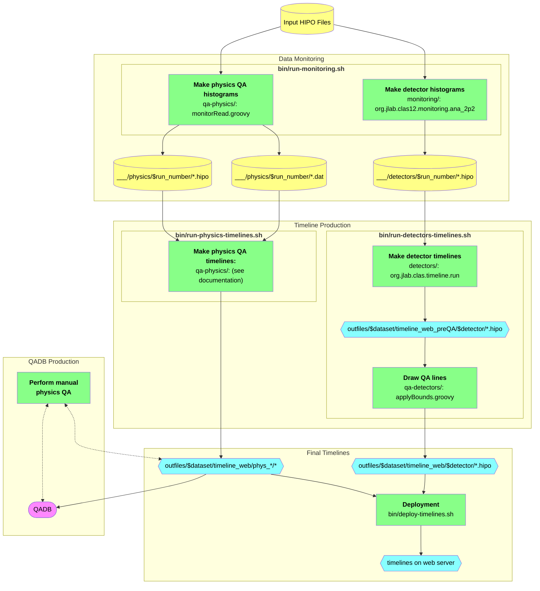

# clas12-timeline

Timeline production for CLAS12. Timelines are deployed to [`clas12mon`](https://clas12mon.jlab.org).

## Setup

To download,
```bash
git clone https://github.com/JeffersonLab/clas12-timeline.git
```

To build,
```bash
mvn package
```
#### Additional Build Notes:
- Use `mvn clean` if you want to clean build targets.
- Use the `-f` option of `mvn` to build individual submodules:
  1. [`monitoring`](monitoring): generates histograms for detectors
  1. [`detectors`](detectors): uses detector histograms to generate timelines

## Procedure

Two types of timelines are produced:
1. **Detector timelines**: monitor detector parameters, histograms, and calibration
1. **Physics timelines**: monitor higher-level quantities to perform Quality Assurance (QA) for physics analysis

NOTE: physics timeline production and QA are typically only valuable on high-statistics datasets, whereas detector timelines need files produced with `mon` schema, which are typically only produced with low statistics; therefore, for a given dataset, typically one set of timelines is produced but not the other.

Both of these timeline types are produced in the following steps:

### Step 1: Data Monitoring

This step reads input HIPO files (_e.g._, DST or `mon` files) and produces histograms and auxiliary files, which are then consumed by Step 2 to produce the timelines. Since many input files are read, it is recommended to use a computing cluster.

This step can either be run during the usual data cooking procedure, using [`clas12-workflow`](https://github.com/baltzell/clas12-workflow) (see its usage guide), or it may be run separately on already-cooked data using:
```bash
bin/run-monitoring.sh
```
Running it with no arguments will print the usage guide; use the `--help` option for more detailed guidance.

#### Example
If using `clas12-workflow`, see it's documentation; otherwise if using `run-monitoring.sh`:
```bash
bin/run-monitoring.sh -d rga_sp19_v5 /volatile/clas12/rg-a/production/pass0/sp19/v5/mon
```
- sets the `dataset` name to `"rga_sp19_v5"`, which will be referenced in subsequent steps
- assumes the input data are found in `/volatile/clas12/rg-a/production/pass0/sp19/v5/mon`

Then run one (or both) of the printed `sbatch` commands:
```bash
sbatch ./slurm/job.rga_sp19_v5.detectors.slurm   # for detector timelines (need mon schema)
sbatch ./slurm/job.rga_sp19_v5.physics.slurm     # for physics timelines
```
- monitor progress with Slurm tools (e.g., `squeue -u $LOGNAME`)
- monitor output logs in `/farm_out/$LOGNAME/` or use `bin/error-print.sh`

#### Details
- data monitoring for detector timelines is handled by the [`monitoring/` subdirectory](monitoring);
  see [its documentation](monitoring/README.md)
- data monitoring for physics timelines is handled by the [`qa-physics/` subdirectory](qa-physics);
  see [its documentation](qa-physics/README.md)

### Step 2: Timeline Production and QA

After Step 1 is complete, run the following Step 2 scripts to produce the timeline HIPO files and to run the automatic QA procedures. There is one script for each timeline type: run them with no arguments to print the usage guides:

```bash
bin/run-detectors-timelines.sh
bin/run-physics-timelines.sh
```

#### Example
**If** you used `clas12-workflow` for Step 1:
```bash
bin/run-detectors-timelines.sh -d rga_sp19_v5 -i /path/to/output/files   # for detector timelines
bin/run-physics-timelines.sh   -d rga_sp19_v5 -i /path/to/output/files   # for physics timelines
```
- the dataset is _given_ the name `"rga_sp19_v5"` (and does not have to be related to any name given from Step 1)
- the output from `clas12-workflow` is `/path/to/output/files`; its subdirectories should be run numbers

**Otherwise**, you may omit the `-i /path/to/output/files` option (unless you customized it from Step 1):
```bash
bin/run-detectors-timelines.sh -d rga_sp19_v5   # for detector timelines
bin/run-physics-timelines.sh   -d rga_sp19_v5   # for physics timelines
```
- the dataset name must match that of Step 1, otherwise you need to specify the path to the input files with `-i`


#### Details
- detector timeline production is handled by the [`detectors/` subdirectory](detectors);
  see [its documentation](detectors/README.md)
- QA of detector timelines is handled by the [`qa-detectors/` subdirectory](qa-detectors);
  see [its documentation](qa-detectors/README.md)
- physics timeline production and QA are handled by the [`qa-physics/` subdirectory](qa-physics);
  see [their documentation](qa-physics/README.md)

### Step 3: Deployment

To view the timelines on the web, you must deploy them by copying the timeline HIPO files to a directory with a running web server. Note that you must have write-permission for that directory. To deploy, run (with no arguments, for the usage guide):

```bash
bin/deploy-timelines.sh
```

If all went well, a URL for the new timelines will be printed; open it in a browser to view them.

#### Example
```bash
bin/deploy-timelines.sh -d rga_sp19_v5 -t rga/sp19/pass0/v5 -D   # deploy to a run-group web directory (for chefs)
### or ###
bin/deploy-timelines.sh -d rga_sp19_v5 -t $LOGNAME/my_test -D    # deploy to a personal web directory (for testing)
```
- this will _only_ print what will be done: deploy the timelines from dataset `"rga_sp19_v5"` (defined in previous step(s)) to the printed path
  - you must have write access to that path; contact the maintainers if you need help with this
  - if you are a chef, consider using the appropriate run group subdirectory, _e.g._, `rga/sp19/pass0/v5`
- if it looks correct, remove the `-D` option to deploy for real and follow the printed URL

# Flowchart
Here is a flowchart illustrating the data and steps for timeline production. See the next section for details on output file organization.



# Output Files Tree

The following shows the tree of output files produced by code in this repository. A unique dataset name `$dataset` is used by most scripts, and almost all output files are contained in `outfiles/$dataset`.

Temporary files are additionally stored in `tmp/`, including backups (for the case when you re-run timelines for the same `$dataset`)

```
outfiles
└── $dataset
    │
    ├── timeline_detectors            # histograms, etc. for detector timelines, from `bin/run-monitoring.sh`
    │   │
    │   ├── 5000                      # for run number 5000
    │   │   ├── out_HTCC_5000.hipo
    │   │   ├── out_LTCC_5000.hipo
    │   │   └── ...
    │   │
    │   ├── 5001                      # for run number 5001
    │   └── ...
    │
    ├── timeline_physics              # histograms, etc. for physics timelines, from `bin/run-monitoring.sh`
    │   │
    │   ├── 5000                      # for run number 5000
    │   │   ├── data_table_5000.dat
    │   │   └── monitor_5000.hipo
    │   │
    │   ├── 5001                      # for run number 5001
    │   └── ...
    │
    ├── timeline_physics_qa           # transient files for the physics QA
    │   ├── outdat
    │   │   ├── qaTree.json           # QADB
    │   │   ├── qaTreeFT.json         # QADB for FT only
    │   │   ├── chargeTree.json       # FC charge info
    │   │   └── data_table.dat        # combined data_table*.dat from each run
    │   ├── outmon                    # timeline (and other) HIPO files
    │   └── outmon.qa                 # QADB timelines
    │
    ├── timeline_web_preQA            # detector timelines, before QA lines are drawn
    │   ├── htcc
    │   ├── ltcc
    │   └── ...
    │
    ├── timeline_web                  # final output timeline files, for deployment to web server
    │   │
    │   ├── htcc                      # detector timelines, with QA, from `bin/run-detectors-timelines.sh`
    │   ├── ltcc
    │   ├── ...
    │   │
    │   ├── phys_qa                   # physics timelines, with QA, from `bin/run-physics-timelines.sh`
    │   ├── phys_qa_extra             # extra physics QA timelines, for experts
    │   └── qadb                      # QADB results timeline
    │
    └── log                           # log files from `bin/run-*-timelines.sh` (not slurm logs (/farm_out/$LOGNAME/))
        ├── $timeline.out
        └── $timeline.err
```

# Notes on SWIF Workflows

For [CLAS12 `swif` workflow](https://github.com/baltzell/clas12-workflow) integration, the `bin/run-monitoring.sh` script (which normally generates `slurm` jobs) has a specific mode `--swifjob`:
```bash
bin/run-monitoring.sh --swifjob --focus-detectors   # generate files for detector timelines
bin/run-monitoring.sh --swifjob --focus-physics     # generate files for physics QA timelines
```
Either or both of these commands is _all_ that needs to be executed on a runner node, within [`clas12-workflow`](https://github.com/baltzell/clas12-workflow); calling one of these will automatically run the wrapped code, with the following assumptions and conventions:
- input HIPO files are at `./` and only a single run will be processed
- run number is obtained by `RUN::config` from one of the HIPO files; all HIPO files are assumed to belong to the same run
- all output files will be in `./outfiles` (no `$dataset` subdirectory as above)

The output files `./outfiles/` are moved to the `swif` output target, following the usual file tree convention with run-number subdirectories:
```
top_level_target_directory
  │
  ├── detectors
  │   ├── 005000  # run 5000; corresponding output files from `--focus-detectors` in `outfiles/` are moved here
  │   ├── 005001  # run 5001
  │   └── ...
  │
  ├── physics
  │   ├── 005000  # run 5000; corresponding output files from `--focus-physics` in `outfiles/` are moved here
  │   └── ...
  │
  ├── recon
  │
  ├── train
  │
  └── ...
```
For compatibility with the file tree expected by downstream `bin/run-*-timelines.sh` scripts (see above), symbolic links may be made to these `timeline_{detectors,physics}` directories, but this is not required since these scripts also allow for the specification of an input directory.

Separate `--focus-detectors` and `--focus-physics` options are preferred, since:
- offers better organization of the contract data between `swif` jobs and downstream scripts
- often we will run one and not the other: `--focus-detectors` needs `mon` schema, whereas `--focus-physics` prefers high statistics


## QA Database (QADB) Production

The [QADB](https://github.com/JeffersonLab/clas12-qadb) is produced by the physics timeline QA, typically only for a fully cooked dataset. It is automatically produced from the physics QA, but it is highly recommended to perform a "manual QA" afterward, by looking at the automatic QA results, cross checking with the experimental log book, and modifying the QADB accordingly.

See [its documentation here](qa-physics) for more details.
