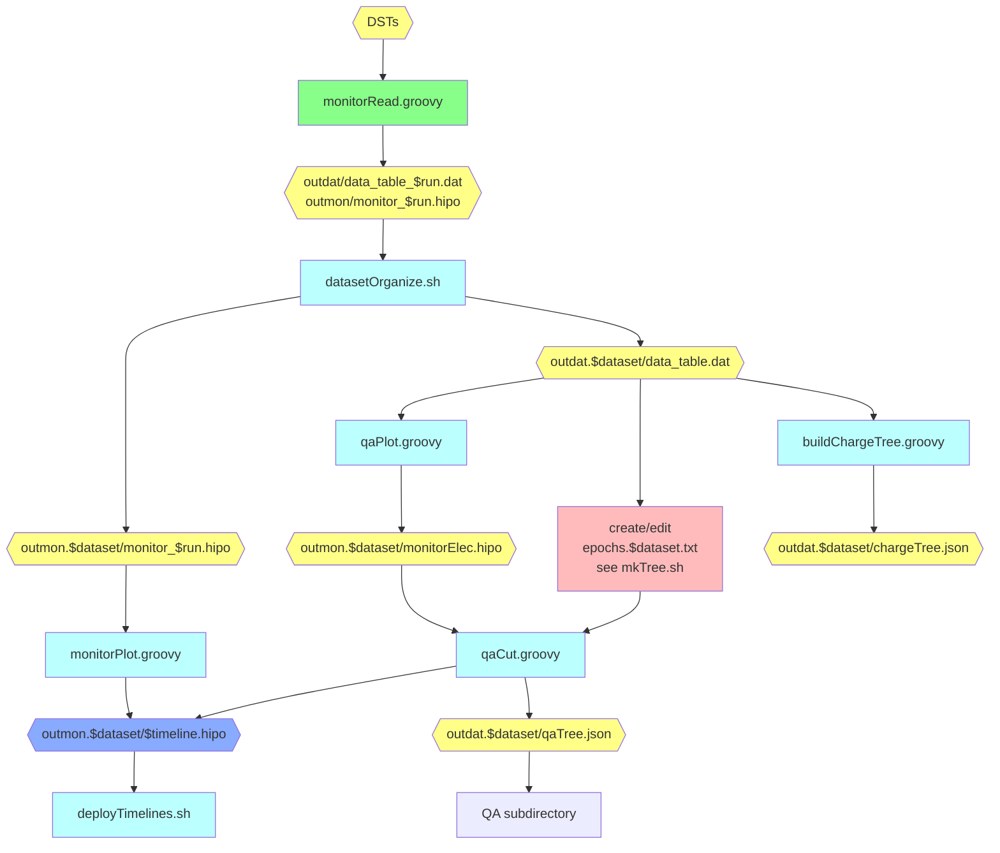
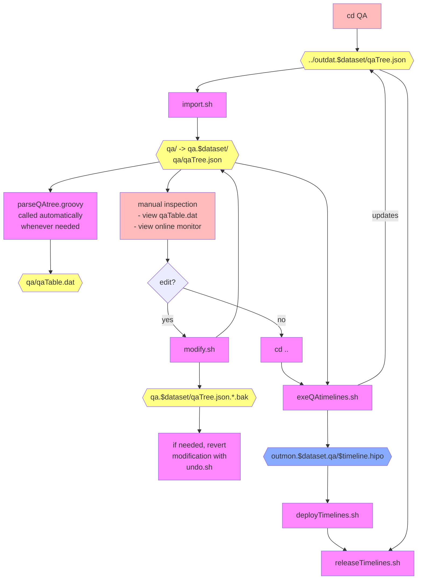

docDiagram

# Automatic QA Procedure
- yellow hexagons: data
- blue hexagons: timeline HIPO files
- green rectangles: scripts automated by `exeSlurm.sh`
- blue rectangles: scripts automated by `exeTimelines.sh`
- arrows denote input and output of scripts, and show dependencies

# Manual QA
### Note: `cd` to the `QA` subdirectory
- all scripts are run manually here (except `parseQAtree.groovy`, which runs automatically)

