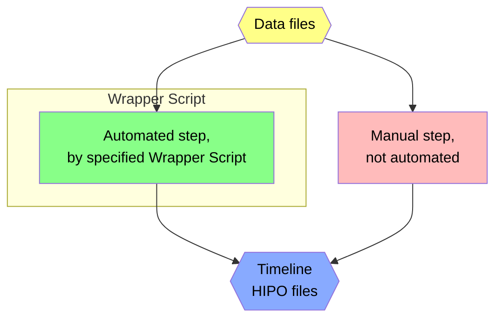

# QA Timeline Production Flowchart

## Legend


## Flowchart

Note: output directories `$output_dir` and `$qa_dir` are typically set by wrapper scripts, and may vary depending on how they are run.

```mermaid
flowchart TB

    subgraph "Automated by ../bin/run-monitoring.sh"
      dst{{DSTs}}:::data
      monitorRead[monitorRead.groovy]:::auto
      monitorReadOut{{$output_dir/data_table_$run.dat<br>$output_dir/monitor_$run.hipo}}:::data
      dst --> monitorRead
      monitorRead --> monitorReadOut
    end

    subgraph "Automated by ../bin/run-physics-timelines.sh"
      datasetOrganize[datasetOrganize.sh]:::auto
      outmonFiles{{$qa_dir/outmon/monitor_$run.hipo}}:::data
      outdatFiles{{$qa_dir/outdat/data_table.dat}}:::data
      monitorReadOut --> datasetOrganize
      datasetOrganize --> outmonFiles
      datasetOrganize --> outdatFiles
      
      monitorPlot[monitorPlot.groovy]:::auto
      timelineFiles{{$qa_dir/outmon/$timeline.hipo}}:::timeline
      outmonFiles --> monitorPlot
      monitorPlot --> timelineFiles

      qaPlot[qaPlot.groovy]:::auto
      createEpochs[create or edit<br>epochs/epochs.$dataset.txt<br>see mkTree.sh]:::manual
      monitorElec{{$qa_dir/outmon/monitorElec.hipo}}:::data
      outdatFiles --> qaPlot
      outdatFiles --> createEpochs
      qaPlot --> monitorElec

      qaCut[qaCut.groovy]:::auto
      mergeFTandFD[mergeFTandFD.groovy]:::auto
      qaTreeFD{{$qa_dir/outdat/qaTreeFD.json}}:::data
      qaTreeFT{{$qa_dir/outdat/qaTreeFT.json}}:::data
      qaTree{{$qa_dir/outdat/qaTree.json}}:::data
      monitorElec --> qaCut
      createEpochs --> qaCut
      qaCut --> timelineFiles
      qaCut --> qaTreeFD --> mergeFTandFD
      qaCut --> qaTreeFT --> mergeFTandFD
      mergeFTandFD --> qaTree

      buildCT[buildChargeTree.groovy]:::auto
      chargeTree{{$qa_dir/outdat/chargeTree.json}}:::data
      stage0[stageTimelines.sh]:::auto
      outdatFiles --> buildCT
      buildCT --> chargeTree
      timelineFiles --> stage0
    end
    
    subgraph Manual QA, in QA subdirectory
      import[import.sh]:::manual
      qaLoc{{qa/ -> qa.$dataset/<br>qa/qaTree.json}}:::data
      parse[parseQAtree.groovy<br>called automatically<br>whenever needed]:::auto
      qaTable{{qa/qaTable.dat}}:::data

      qaTree --> import
      import --> qaLoc
      qaLoc --> parse
      parse --> qaTable
      
      inspect[manual inspection<br>- view qaTable.dat<br>- view online monitor]:::manual
      qaTable --> inspect
      inspect --> edit{edit?}

      modify[modify.sh]:::manual
      qaBak{{qa.$dataset/qaTree.json.*.bak}}:::data
      undo[if needed, revert<br>modification with<br>undo.sh]:::manual
      edit -->|yes|modify
      modify --> qaLoc
      modify --> qaBak
      qaBak --> undo
    end

    subgraph Finalize
      exeQAtimelines[exeQAtimelines.sh]:::manual
      qaTreeUpdated{{$qa_dir/outdat/qaTree.json}}:::data
      qaTL{{$qa_dir/outmon.qa/$timeline.hipo}}:::timeline
      stage1[stageTimelines.sh]:::manual
      qaLoc --> exeQAtimelines
      exeQAtimelines --> qaTL
      exeQAtimelines -->|updates|qaTreeUpdated
      qaTL --> stage1
    end

    qaTree --> cd0[cd QA]:::manual
    cd0 --> import
    edit -->|no|cd1[cd ..]:::manual
    cd1 --> exeQAtimelines

    classDef data fill:#ff8,color:black
    classDef auto fill:#8f8,color:black
    classDef manual fill:#fbb,color:black
    classDef timeline fill:#8af,color:black
```
