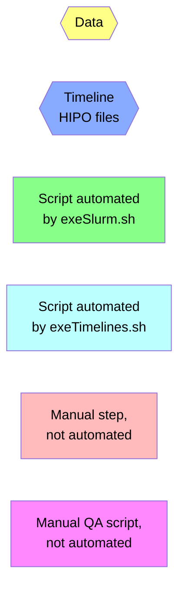
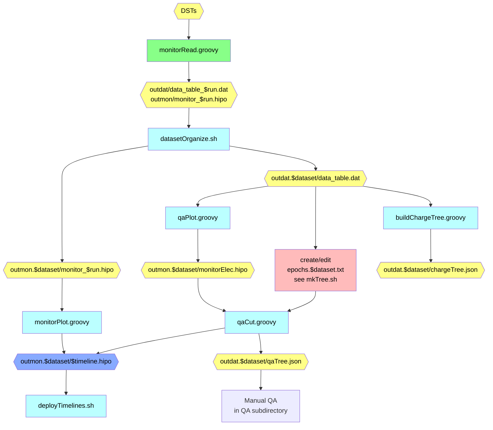
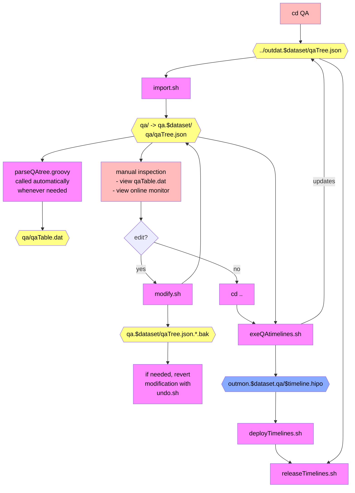

# QA Timeline Production Flowchart

## Legend

## Automatic QA Procedure

## Manual QA Procedure
- `cd` to the `QA` subdirectory; scripts are run manually here
  - except for `parseQAtree.groovy`, which runs automatically
  - except for `exeQAtimelines.sh`, which is meant to be run as one of the final steps from the top-level directory

