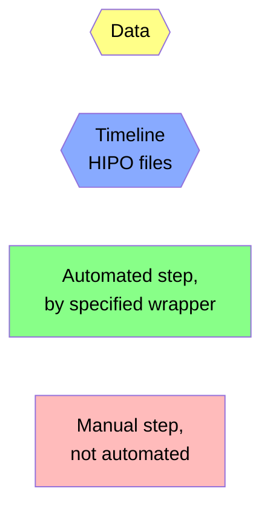

# QA Timeline Production Flowchart

## Legend


## Flowchart

```mermaid
flowchart TD

    subraph Automated by exeSlurm.sh
      dst{{DSTs}}:::data --> monitorRead[monitorRead.groovy]:::auto
      monitorRead --> monitorReadOut{{outdat/data_table_$run.dat<br>outmon/monitor_$run.hipo}}:::data
    end

    subraph Automated by exeTimelines.sh
      monitorReadOut --> do[datasetOrganize.sh]:::auto
      do --> dm{{outmon.$dataset/monitor_$run.hipo}}:::data
      do --> dt{{outdat.$dataset/data_table.dat}}:::data
      
      dm --> monitorPlot[monitorPlot.groovy]:::auto
      monitorPlot --> tl{{outmon.$dataset/$timeline.hipo}}:::timeline
      
      dt --> qaPlot[qaPlot.groovy]:::auto
      dt --> man[create/edit<br>epochs.$dataset.txt<br>see mkTree.sh]:::manual
      qaPlot --> monitorElec{{outmon.$dataset/monitorElec.hipo}}:::data
      monitorElec --> qaCut[qaCut.groovy]:::auto
      man --> qaCut
      qaCut --> tl
      qaCut --> qaTree{{outdat.$dataset/qaTree.json}}:::data
      dt --> buildCT[buildChargeTree.groovy]:::auto
      buildCT --> chargeTree{{outdat.$dataset/chargeTree.json}}:::data
      
      tl --> deploy[deployTimelines.sh]:::auto
    end

    qaTree --> cd0[cd QA]:::manual
    
    subraph Manual QA, in QA subdirectory
      cd0 --> import[import.sh]:::manual
      qaTree --> import
      import --> qaLoc{{qa/ -> qa.$dataset/<br>qa/qaTree.json}}:::data
      qaLoc --> parse[parseQAtree.groovy<br>called automatically<br>whenever needed]:::auto
      parse --> qaTable{{qa/qaTable.dat}}:::data
      
      qaLoc --> inspect[manual inspection<br>- view qaTable.dat<br>- view online monitor]:::manual
      inspect --> edit{edit?}
      
      edit -->|yes|modify[modify.sh]:::manual
      modify --> qaLoc
      modify --> qaBak{{qa.$dataset/qaTree.json.*.bak}}:::data
      qaBak --> undo[if needed, revert<br>modification with<br>undo.sh]:::manual
    end

    edit -->|no|cd1[cd ..]:::manual

    subgraph Finalize
      cd1 --> qa[exeQAtimelines.sh]:::manual
      qaLoc --> qa
      qa --> qaTL{{outmon.$dataset.qa/$timeline.hipo}}:::timeline
      qa -->|updates|qaTree
      qaTL --> deploy[deployTimelines.sh]:::manual
      deploy --> release[releaseTimelines.sh]:::manual
      qaTree --> release
    end

    classDef data fill:#ff8,color:black
    classDef auto fill:#8f8,color:black
    classDef manual fill:#fbb,color:black
    classDef timeline fill:#8af,color:black
```
