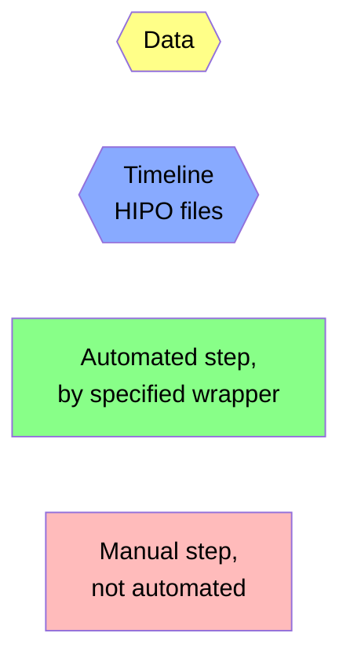

# QA Timeline Production Flowchart

## Legend


## Flowchart

```mermaid
flowchart TD

    subgraph Automated by exeSlurm.sh
      dst{{DSTs}}:::data
      monitorRead[monitorRead.groovy]:::auto
      monitorReadOut{{outdat/data_table_$run.dat<br>outmon/monitor_$run.hipo}}:::data
      dst --> monitorRead
      monitorRead --> monitorReadOut
    end

    subgraph Automated by exeTimelines.sh
      datasetOrganize[datasetOrganize.sh]:::auto
      outmonFiles{{outmon.$dataset/monitor_$run.hipo}}:::data
      outdatFiles{{outdat.$dataset/data_table.dat}}:::data
      monitorReadOut --> datasetOrganize
      datasetOrganize --> outmonFiles
      datasetOrganize --> outdatFiles
      
      monitorPlot[monitorPlot.groovy]:::auto
      timelineFiles{{outmon.$dataset/$timeline.hipo}}:::timeline
      outmonFiles --> monitorPlot
      monitorPlot --> timelineFiles

      qaPlot[qaPlot.groovy]:::auto
      createEpochs[create/edit<br>epochs.$dataset.txt<br>see mkTree.sh]:::manual
      monitorElec{{outmon.$dataset/monitorElec.hipo}}:::data
      outdatFiles --> qaPlot
      outdatFiles --> createEpochs
      qaPlot --> monitorElec

      qaCut[qaCut.groovy]:::auto
      qaTree{{outdat.$dataset/qaTree.json}}:::data
      monitorElec --> qaCut
      createEpochs --> qaCut
      qaCut --> timelineFiles
      qaCut --> qaTree

      buildCT[buildChargeTree.groovy]:::auto
      chargeTree{{outdat.$dataset/chargeTree.json}}:::data
      deploy0[deployTimelines.sh]:::auto
      outdatFiles --> buildCT
      buildCT --> chargeTree
      timelineFiles --> deploy0
    end

    qaTree --> cd0[cd QA]:::manual
    
    subgraph Manual QA, in QA subdirectory

      import[import.sh]:::manual
      qaLoc{{qa/ -> qa.$dataset/<br>qa/qaTree.json}}:::data
      parse[parseQAtree.groovy<br>called automatically<br>whenever needed]:::auto
      qaTable{{qa/qaTable.dat}}:::data

      cd0 --> import
      qaTree --> import
      import --> qaLoc
      qaLoc --> parse
      parse --> qaTable
      
      inspect[manual inspection<br>- view qaTable.dat<br>- view online monitor]:::manual
      qaLoc --> inspect
      inspect --> edit{edit?}


      modify[modify.sh]:::manual
      qaBak{{qa.$dataset/qaTree.json.*.bak}}:::data
      undo[if needed, revert<br>modification with<br>undo.sh]:::manual
      edit -->|yes|modify
      modify --> qaLoc
      modify --> qaBak
      qaBak --> undo
    end

    edit -->|no|cd1[cd ..]:::manual

    subgraph Finalize
      qa[exeQAtimelines.sh]:::manual
      qaTL{{outmon.$dataset.qa/$timeline.hipo}}:::timeline
      deploy1[deployTimelines.sh]:::manual
      release[releaseTimelines.sh]:::manual
      cd1 --> qa
      qaLoc --> qa
      qa --> qaTL
      qa -->|updates|qaTree
      qaTL --> deploy1
      deploy1 --> release
      qaTree --> release
    end

    classDef data fill:#ff8,color:black
    classDef auto fill:#8f8,color:black
    classDef manual fill:#fbb,color:black
    classDef timeline fill:#8af,color:black
```
