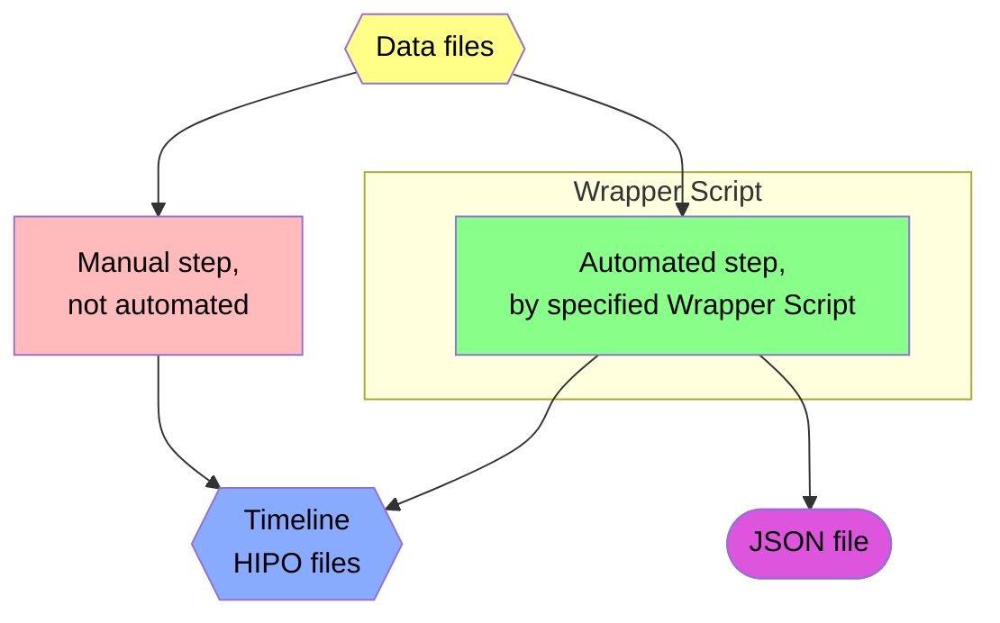
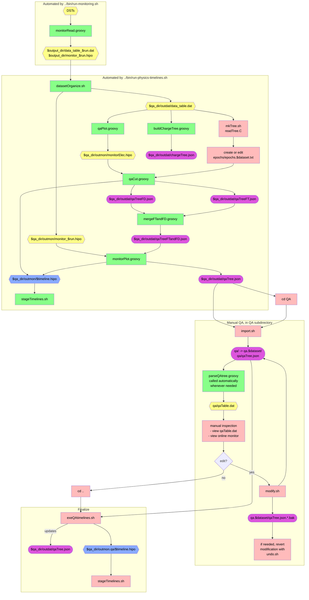

# QA Timeline Production Flowchart

## Legend

## Flowchart

Note: output directories `$output_dir` and `$qa_dir` are typically set by wrapper scripts, and may vary depending on how they are run.

